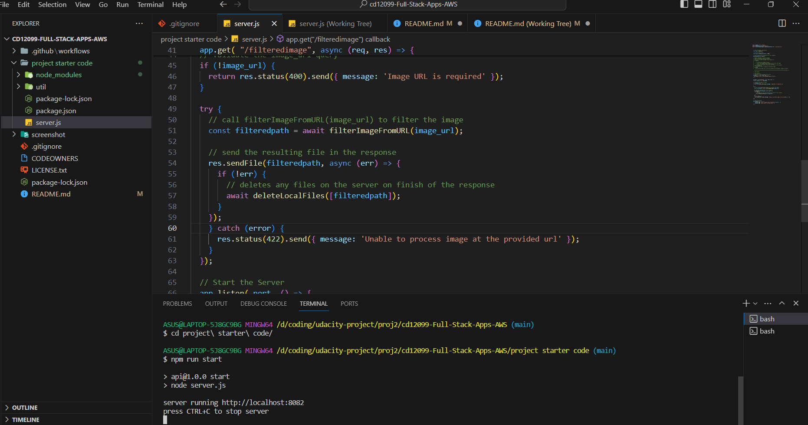
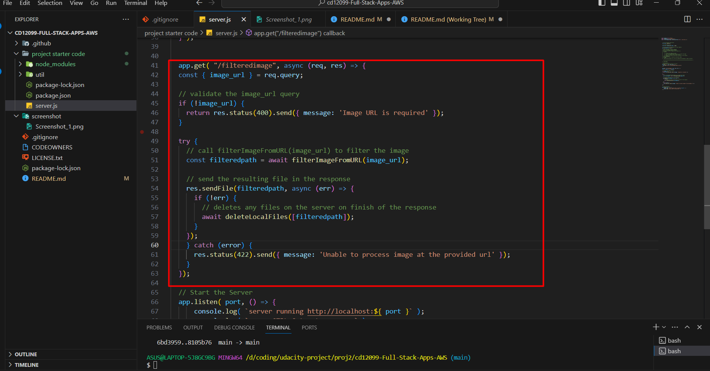
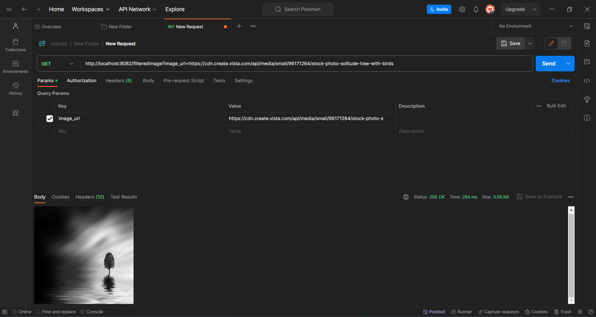
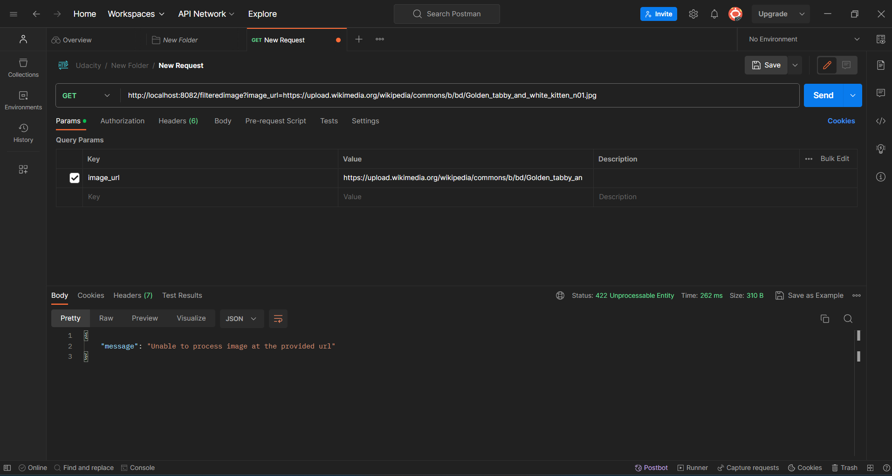
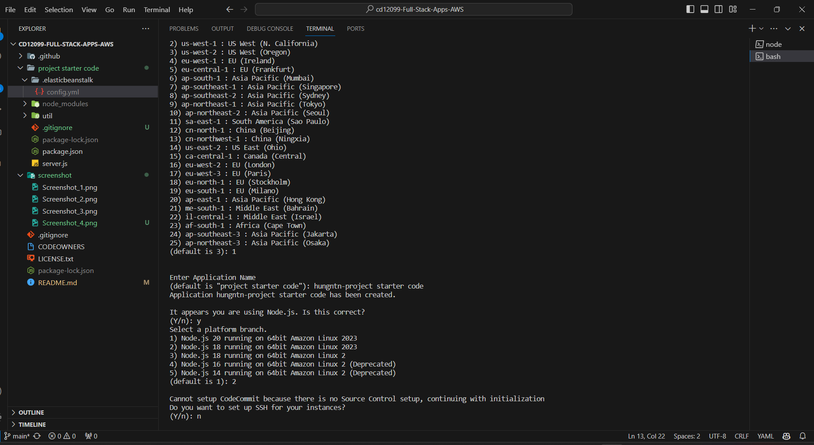
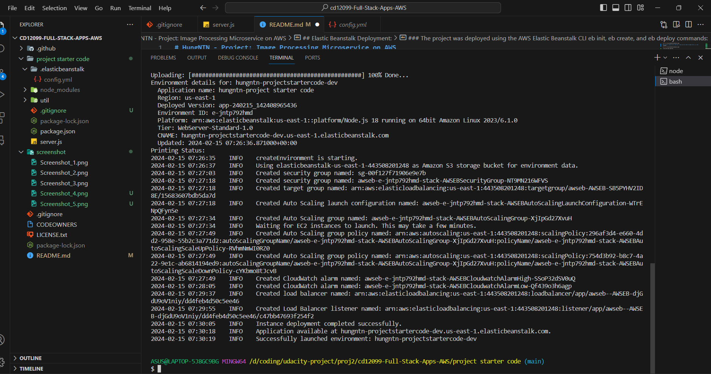
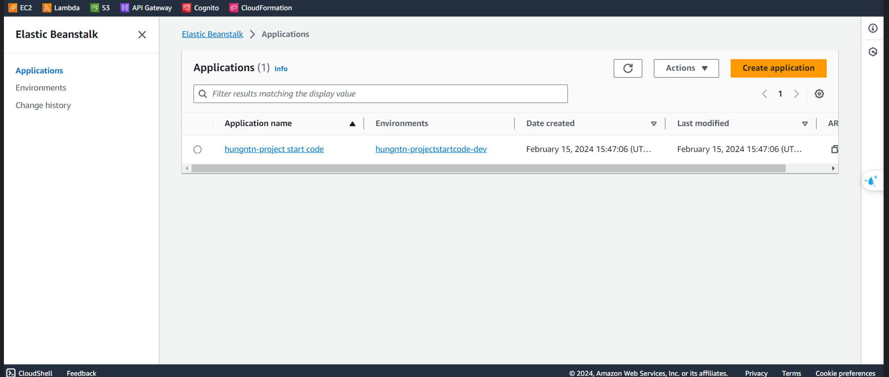
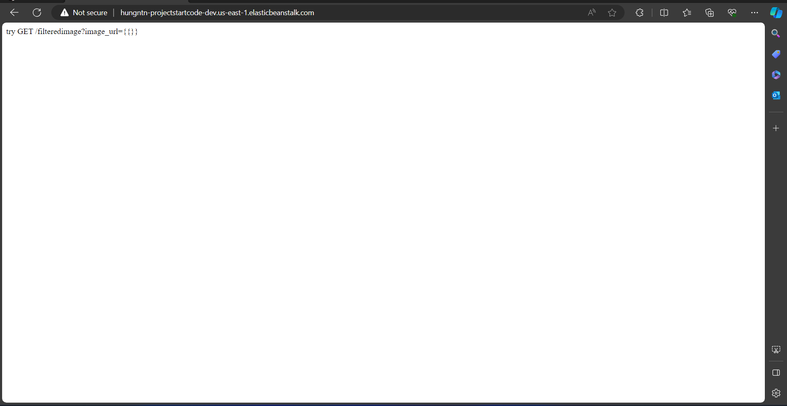
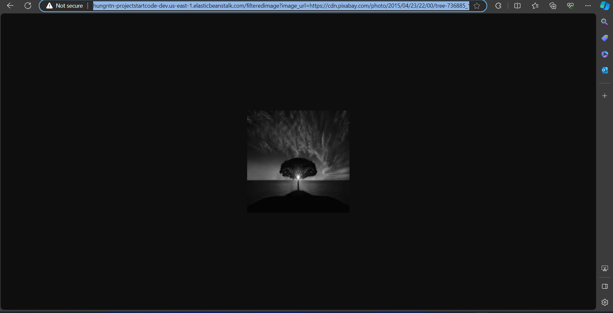

# HungNTN - Project: Image Processing Microservice on AWS

## Development Server:

### Starting the server with npm run dev runs a local instance of the server with no errors:

### The stubbed @TODO1 endpoint in src/server.js is completed and accepts valid requests including: http://localhost:{{PORT}}/filteredimage?image_url=https://upload.wikimedia.org/wikipedia/commons/b/bd/Golden_tabby_and_white_kitten_n01.jpg:

- Code:

### Successful responses have a 200 code, at least one error code for caught errors (i.e. 422):
- Success:

- Fail with status code 422:

## Elastic Beanstalk Deployment:

### The project was deployed using the AWS Elastic Beanstalk CLI eb init, eb create, and eb deploy commands:

- eb init:

- eb create:

### A screenshot of the elastic beanstalk application dashboard is included in a deployment_screenshot directory:

### Access successfully with url : http://hungntn-projectstartcode-dev.us-east-1.elasticbeanstalk.com/

### An endpoint URL for a running elastic beanstalk deployment (EB_URL) has been submitted along with the project submission. This endpoint responds to valid GET requests including: http://hungntn-projectstartcode-dev.us-east-1.elasticbeanstalk.com/filteredimage?image_url=https://cdn.pixabay.com/photo/2015/04/23/22/00/tree-736885_1280.jpg:

